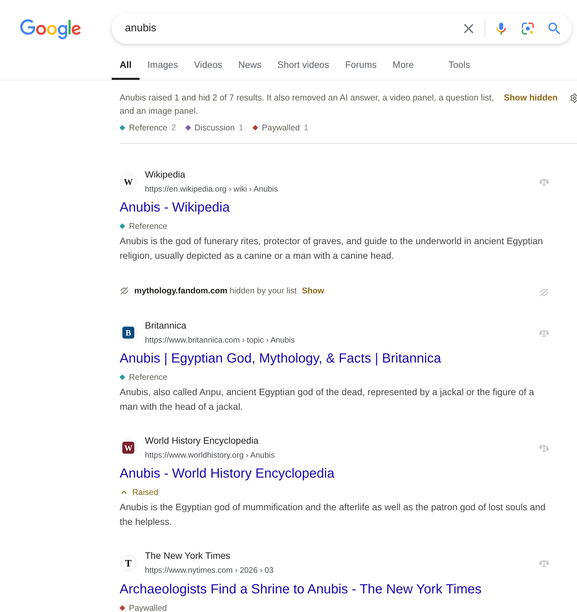

# Anubis style guide

How Anubis looks and reads on every surface it has: the popup, settings, the welcome page, and the tags, summary, and result menu it adds to search pages. Follow it for any change to the interface.

- `CLAUDE.md` and `CONTRIBUTING.md` give the short version of these rules.
- [`ACCESSIBILITY.md`](ACCESSIBILITY.md) covers the keyboard and screen readers. This guide only repeats what's visual (contrast, sizes, the focus ring).
- `docs/experiments.md` records why things are the way they are, including what was tried and dropped.

The screenshots below come from the wiki (`docs/img/`, regenerated with `node e2e/run.mjs docs`), so they show the current build. When an interface change affects one, regenerate the affected light and dark screenshots and update their nearby descriptions together; don't include unrelated generated files.

## Principles

1. **Quiet on someone else's page.** On a search page Anubis is a guest. It uses the page's own font, muted text, hairlines, and no fills. It never moves, restyles, or covers the engine's content.
2. **One flourish.** The result menu's cartouche (the gold oval around the site's name) and balance are the only decoration. The popup shows the same pair for the site you're on, since it does the same job there. The Anubis motif stays in the logo and the menu; it never names a function.
3. **Plain words over clever ones.** A label says what happens. The same word means the same thing everywhere.
4. **Nothing without a trace.** What Anubis hid, removed, or reranked is stated in the summary, and "Show hidden" undoes it for the page. Deleting in Settings doesn't ask "Are you sure?" (a browser can be told to stop showing a page's dialogs, and then the answer is always no): it acts, says what it did, and offers Undo.
5. **Gold is for what matters.** The primary action, focus, a choice that's been made, and the cartouche. Nothing else is gold.
6. **Red is for errors and deleting.** `--danger` marks an error or an action that throws something away, and nothing else. A ranking is never red: a chosen Hide is grey, like Lower and Normal, since hiding a site is a choice, not a mistake. `tests/palette.test.ts` fails when a Hide rule uses `--danger`.



Everything Anubis adds here is in the page's font and colours except gold for what you can press: the summary's sentence and buttons, the tags under each title, the folded line for a hidden site, and the faint ⚖ button on each result.

## Colour

One palette, defined twice: `assets/theme.css` for extension pages and `entrypoints/content/shadow.css` for search pages. The names and values are the same in both; keep them in step (`tests/palette.test.ts` fails when they drift). Hex values appear only in those two files, `utils/listformat.ts` (tag colours) and the docs theme (`docs/.vitepress/theme/brand.css`, the same values under VitePress's names).

| Token | Dark (brand default) | Light | Use |
| --- | --- | --- | --- |
| `--bg` | `#1b1a16` | `#f2f3f1` | Page background (extension pages only; on search pages the engine owns it) |
| `--raised` | `#23211c` | `#fbfbfa` | Inputs, the result menu's card |
| `--line` | `#35312a` | `#dadcd7` | Hairlines between sections and rows |
| `--line-strong` | `#4a453c` | `#c3c6bf` | Borders of inputs, selects, and buttons; a switch that's off |
| `--text` | `#ece6da` | `#1f1e1a` | Body text |
| `--muted` | `#a39b8c` | `#62615b` | Secondary text, section labels, unchosen options, icons at rest |
| `--gold` | `#d4a637` | `#d4a637` | Fills and strokes: primary button, chosen underline, focus ring, cartouche, balance |
| `--gold-ink` | `#e0b54e` | `#8d6716` | Gold text and icons, readable on the background: text buttons, links, Raise, and Pin |
| `--on-gold` | `#1b1a16` | `#1b1a16` | Text on a gold fill |
| `--danger` | `#e2735b` | `#b4492f` | Errors and destructive actions. Never a ranking: Hide is grey. |
| `--ok` | `#7fb58f` | `#3a7a52` | Confirmations (settings only) |
| `--shadow` | | | The result menu's shadow (search pages only), darker in the dark scheme |

- The light scheme is cool museum stone, not cream or paper.
- Use `--gold` for anything filled or stroked and `--gold-ink` for anything read. Gold text in `--gold` fails contrast on light backgrounds.
- Tags carry their own colour (`--c`), from the list or from `TAG_PALETTE` in `utils/listformat.ts`: muted Egyptian pigments (ochres, malachite, Egyptian blue, amethyst, turquoise, papyrus, umber) that sit quietly on light and dark pages.
- On search pages, **Settings → Appearance → Colours on search pages** can switch to *Plain*. Hosts then carry `data-palette="plain"` and `<html>` carries `data-anubis-palette="plain"`: `--gold` becomes `--muted`, `--gold-ink` becomes `--text` and `--danger` becomes `--muted`. Tag marks are grey, and the pinned frame and highlights take the page's text colour. So a new colour on search pages goes through these tokens, never `--c` or a hex value alone, or it stays coloured in Plain. What you can press keeps its weight (600), so it still reads as a button. Extension pages stay gold.
- Every surface follows the theme setting (Auto, Light, Dark). On search pages, "Auto" follows the page's background for what sits on the page, and the browser's scheme for the result menu, which matches the popup.

```css
/* Do: tokens, gold-ink for text you read */
.list-facts a { color: var(--gold-ink); }
.row + .row { border-top: 1px solid var(--line); }

/* Don't: a new hex value, or --gold on text */
.list-facts a { color: #d4a637; }
.row { background: #2a2720; }
```

## Type

**Families**

- Interface: `system-ui, -apple-system, 'Segoe UI', Roboto, sans-serif`, set once on `body` in `theme.css`. On search pages, the page's own font, except the result menu, which uses the interface stack.
- Display: `'Iowan Old Style', 'Palatino Linotype', Palatino, 'Book Antiqua', Georgia, serif` (the `.serif` class). Only for the brand name, page and section titles on extension pages, and a site's name where it's the subject (the cartouche, the popup's site).
- Code: `ui-monospace, 'SF Mono', Menlo, Consolas, monospace`, for list text and code.

**Scale.** Use these sizes and no others.

| Size | Weight | Use | Example |
| --- | --- | --- | --- |
| 34px serif (29px on phones) | 400 | The welcome page's title | "Anubis is installed" |
| 30px serif | 400 | A settings section's title | "Your sites" |
| 21px serif | 500 | A welcome section's title | "Keep it in the toolbar" |
| 19px serif | 500 | The brand name beside the logo | "Anubis" in the popup's header |
| 16px serif | 500 | A site's name as the subject | "javascript.info" in the cartouche |
| 16px | 400 | The welcome page's lead | |
| 15px | 600 | A heading inside a settings section, a list's name | "Paywalls" |
| 14px | 400 | Body text on extension pages (`body`) | |
| 13px | 400–600 | Controls, descriptions, the result menu, the summary | "Load more results" |
| 12.5px | 400–600 | Small print: hints, counts, tags on results, list facts, section labels in the popup and menu | "4 lists, 7 tags" |

- Weights are 400, 500, and 600. Bold (600) is for the chosen option, names, and primary and text buttons.
- Sentence case everywhere. No ALL-CAPS labels, no letter-spaced eyebrows.
- Counts use `font-variant-numeric: tabular-nums`.
- Body text stops at about 62 characters (`max-width: 62ch`).

## Space and shape

- Spacing comes in steps of 2px: 4, 6, 8, 10, 12, 14, 16, 18, 24, and so on. Items in a wrapping row of tags or links sit 14px apart; buttons in a row 8px.
- Sections are divided by a 1px `--line` hairline and space, never boxed into cards. The result menu is the only card.
- Corner radius: **6px** for controls (buttons, inputs, selects); **10px** for the result menu and the pinned result's frame; **999px** (a pill) for the cartouche and switches; **50%** for round icon buttons on search pages and colour swatches. The focus ring's corners are 3px where the element has none of its own. Nothing else is rounded, and the logo carries its own rounded tile, so don't round or frame it.
- Shadows only on the result menu (`--shadow`), which floats over the page.

## Layout

| Surface | Layout |
| --- | --- |
| Popup | Up to 340px wide, shrinking to fit a narrower viewport. Header (logo, the status after a diamond that's gold while Anubis is on and hollow while it's off, on/off), then sections under hairlines with a muted label, then a footer. What shows depends on the tab: on a search page, what Anubis did there and its tags to show only; on any other site, that site in the cartouche over the balance, with the rankings, tag choices, and a field to add a tag; elsewhere, Add a site. The last few of your sites always follow. |
| Settings | Two columns in 1040px: a 210px navigation column and sections up to 760px. One row per thing you can change. A tag's open panel has fields for its name and meaning, sites carrying it, and an optional note explaining why a site fits. Below 760px, one column with the navigation across the top. |
| Welcome page | The same idea in 1040px: section titles in a 220px column, what to do beside them, lists two across. Below 900px, one column. |
| Search pages | The summary sits above the results, lined up with them; on phones it's one short line, with Details for the rest. Tags go under each title. The result menu opens under its ⚖ button, 312px wide. |

Every page works at phone width (390px) without scrolling sideways. Settings are also checked at 320px, 360px, 375px, and 389px: only the Your sites table may scroll inside its own wrapper below 390px. Its Add tag picker is at most 8em wide, because a closed select is as wide as its longest option and tag names come from lists. `node e2e/run.mjs responsive` checks all settings sections at those widths and at 390px in light and dark schemes; the `welcome` and `mobile` e2e parts cover their respective pages.


The popup on a site that isn't a search page: header, the site in the cartouche over the balance and rankings, tags as a choice of coloured diamonds, a field to create and apply a tag, your last few sites with their ranking in words (or their tag, when a site has only a tag), and a footer of small print and text buttons. No section is boxed; hairlines divide them.

## Controls

All shared controls are in `assets/theme.css`; the search-page versions in `shadow.css` look the same. Build them with `h()` from `utils/dom.ts`, and take their text from `messages.json` through `t()`.

| Control | Class | Looks | Use it for |
| --- | --- | --- | --- |
| Button | `.btn` | 30px high, 1px `--line-strong` border, transparent, 13px/500; the border turns gold on hover | Actions that stand on their own: "Update all", "Export backup" |
| Small button | `.btn.small` | 26px, 12.5px | Buttons among small print: the popup's Add a site rankings, the welcome page's "Open list settings" |
| Primary button | `.btn.primary` | Gold fill, `--on-gold` text, 600 | The action the form exists for, at most one per form: "Add", "Subscribe", "Connect" |
| Destructive button | `.btn.danger` | `--danger` text; the border turns `--danger` on hover | Actions that throw something away: "Reset settings" |
| Text button | `.text-btn` | No box, `--gold-ink`, 600, underline on hover; `.danger` for removing | Actions inside a sentence or row: "Show hidden", "Undo", "Add tag", "See all 9" |
| Icon button | `.icon-btn` | 28px (24px and round on search pages), `--muted`, gold on hover; `.danger` turns red on hover | Only icons everyone knows: the cog, ×, and a list's update, view, and remove icons. Always with `aria-label` and `title`. |
| Input | `input` | 30px, `--raised`, 1px `--line-strong` border, 6px radius, 13px; the border turns gold on focus | Placeholders in `--muted` give an example ("fandom.com"), not an instruction |
| Amount | `.amount` + `.tip` | A 64px number input with its unit after it in `--muted`; a tip under the setting's description says what the amount costs, in `--muted`, or in `--text` when it warns | A number people choose: Load more results automatically |
| Select | `select` | The same box as an input, with the one caret: a small `--muted` chevron drawn in CSS, 10px from the right edge | Never the browser's own arrow |
| Switch | `.switch` | 30×17px pill, gold when on | Settings that take effect at once; no Save button |
| Choice row | `.seg`, `.levels` | Plain words in `--muted`; the chosen one `--text`, 600, with a 2px underline in gold (`--muted` for Hide, the tag's colour for a tag filter). The rankings put each one's icon over its word: `--muted` at rest, and once chosen `--gold-ink` for Raise and Pin, `--text` for the rest | Choosing one of a few: the rankings, Appearance's options |
| Tag | `.tag` + `.gem` | A 6px diamond in the tag's colour, then its name; hollow for a tag you could add. In the popup, a selected tag also has bold text and a 2px underline in its colour. | Tags everywhere. Never pills or chips with fills. |
| Site name | `siteName()` + `.suffix` | The name in the row's colour, the ending it shares with other sites (`.org`, `.co.uk`) in `--muted` at 400 | A site as a row's subject: the popup's and Settings' Your sites |
| Ranking note | `.level-note`, `.verdict` | Pin and Raise in `--gold-ink`, Hide, Lower, and Normal in `--muted`; pinned and hidden results use their selector icon instead of a redundant chip, while Raised and Lowered chips remain | Naming a site's ranking |

```ts
// A form: one primary button, the rest plain or text buttons.
h('form', { class: 'inline-form' }, urlInput, h('button', { class: 'btn primary', type: 'submit' }, 'Subscribe'));
h('button', { class: 'btn danger', type: 'button', on: { click: reset } }, 'Reset settings');

// An icon button: the icon alone, named for what it acts on.
h('button', { class: 'icon-btn', type: 'button', title: 'Update now', attrs: { 'aria-label': `Update ${name}` }, on: { click: update } }, icon(ICON_REFRESH));

// A switch.
h('label', { class: 'switch' }, h('input', { type: 'checkbox', checked: on }), h('span'));

// A choice row: aria-pressed marks the chosen option.
h('div', { class: 'seg', attrs: { role: 'group', 'aria-label': label } },
  options.map((o) => h('button', { type: 'button', attrs: { 'aria-pressed': String(o === chosen) } }, o)));

// A tag: its colour goes in --c; its name is a text node, never markup.
h('span', { class: 'tag', style: `--c: ${tag.color}` }, h('i', { class: 'gem' }), tag.label);
```

## States

- **Hover**: text goes from `--muted` to `--text`, or an outline turns gold. No background fills on hover, except the ⚖ button's faint gold wash on search pages.
- **Focus**: a 2px `--gold` outline, 2px offset, on `:focus-visible` only. Where a native control sits unseen over a styled one (the cartouche's select), the visible element shows the ring (`:has(select:focus-visible)`).
- **Chosen**: the 2px underline above. Don't use fills, checkmarks, or bold alone.
- **Disabled or busy**: `opacity: 0.6` and `cursor: progress` on buttons, `--muted` text on text buttons. Say what's happening ("Loading…").
- **Off**: when Anubis is off, the popup's content fades to half and the toolbar icon turns grey, with "Anubis is off" as its tooltip.
- **Hidden and removed on search pages**: hidden results leave the page, fold into one muted line with a Show button, or fade, as Settings → Appearance says; the summary counts them. Removed panels that "Show hidden" brings back are marked with a faint dashed outline.


## The summary


One line above the results, in the page's font at 13px, `--muted` for the sentence and `--gold-ink` text buttons after it:

1. **The mark**: the bare Anubis head, the only brand mark on a search page.
2. **The sentence**: what Anubis did, in whole sentences built from messages (`summarySentence` in `utils/summary.ts`): "Anubis raised 1 and hid 2 of 7 results. It also removed an AI answer and a video panel." Clean-up gets its own sentence, never a clause tacked on after a comma.
3. **Buttons**: Show hidden (then "Hide them again"), Load more results, and the cog.
4. **The last change**, when one was made from the result menu: "Pinned javascript.info." and Undo.
5. **The tags on this page**, as a row of tags with counts; pressing one shows only its results.

On phones (600px wide or less) the full sentence runs to several lines, so the summary says it in a few words (`shortSummary`): "Anubis changed 4 of 9 results and cleaned up the page.", then Show hidden and **Details**. Details shows the rest: the full sentence, Load more results, the cog, and the tags; it reads "Fewer details" while open. The last change and Undo always show. Where the full sentence is no longer than the short one ("Anubis hid 1 of 9 results.", only one tag's results shown, or nothing changed), it stands, and Details only appears for what else there is. On phones the mark hangs to the left and everything else lines up with the sentence: its buttons follow its words and wrap with them, so none is left alone on a line under the mark.

## The result menu


The one place with character. In order:

1. **The cartouche**: the site's name, 16px serif, in a 1.5px gold oval, doubled by a 0.75px gold hairline 2.5px inside it at just over half strength, as carved cartouches are drawn. Where the rule can cover more or less of the site (`en.wikipedia.org` or `wikipedia.org`), a caret follows the name and the native select lies unseen over the whole oval, so the oval is exactly as wide as the name and it stays centred. There's no bar at the end of the oval: at this size it read as a text cursor.
2. **The balance**: the site's pan on the left, the feather's on the right, tilting to the chosen ranking. It swings when the ranking changes, and holds still with reduced motion.
3. **Rankings**: Hide, Lower, Normal, Raise, Pin as a choice row, each word under its icon, with a hint underneath that says whose choice it is ("Your choice for javascript.info, on every search.").
4. **Tags**, **Why** (the rules that matched, and links to report or suggest changes to a list) and a footer, each under a hairline with a 12.5px label. Under Why, each rule follows "Matched rule, line 10" in the code face at 12.5px. It breaks only after a comma, with a hanging indent: option names in `--muted`, what they match in `--text`, an option that raises (`boost`, `pin`) in `--gold-ink` at 600, and one that hides (`discard`) in `--text` at 600. `ruleParts()` in `utils/ruletext.ts` splits it.

## Icons

- Inline SVG from `utils/icons.ts`: a 16×16 grid, 1.6px stroke, round caps and joins, `currentColor`. Shown at 13–15px. Decorative, so `aria-hidden`.
- Each ranking has one icon, used everywhere: an eye struck through (Hide), a chevron down (Lower), a feather (Normal), a chevron up (Raise), a pin (Pin). In the popup and the result menu it sits over the ranking's name.
- The balance is drawn in three more places. In the popup it's in `--muted`, level and with empty pans, above Your sites while that list is empty: the only illustration. On the welcome page it sits in gold under the lead (see Motion).
- The Anubis head is the brand mark: the logo tile on extension pages and in the toolbar. Search pages don't show it: the summary is plain text. It's never a button's icon.
- The button on each result shows the result menu's balance in small, tipped to the site's ranking: level for Normal, the site's (left) pan down for Lower, and up for Raise. A hidden site shows the ranking's crossed-out eye and a pinned one its pin. It's drawn in `--muted` like any icon at rest; the tilt, not a colour, shows the ranking, and its label says it too ("Hide, rank, or tag fandom.com (lowered)").
- An icon without words only where the meaning is universal (the cog, ×, and the balance on a result, which names the menu it opens in its tooltip). Everything else gets a word, with or without an icon.

## Motion

- Motion answers an action: the menu opens with a 120ms fade and 3px drop, the balance swings, switches slide.
- Nothing moves on its own. The welcome page's balance swings only when clicked: a click on either side presses that pan down, and it settles level again. It's decoration, hidden from screen readers.
- Movement (the menu's drop, the balance, switches, the welcome page's balance) stops under `prefers-reduced-motion`.

## Writing

- Sentence case, plain verbs, no filler.
- One word per concept. A site's **ranking** is Hide, Lower, Normal, Raise, or Pin. Lists **tag**, **raise**, **lower**, and **hide**; clean-up **removes**. People **subscribe** to lists.
- An action keeps its name through the flow: "Pin" in the menu, "Pinned javascript.info." in the summary.
- Whole sentences, one idea each. When a sentence needs a second "and", start a second sentence.
- Errors say what happened and what to do, in the interface's voice. They don't apologise.
- British spelling ("colour", "recognise"), and the serial (Oxford) comma in lists of three or more: "a, b, and c", "Hide, rank, or tag". Two items take no comma: "a and b". `tJoin()` joins lists that way.
- No "·"-joined meta strings, no "→" on links, no exclamation marks.
- All interface text goes in `public/_locales/en/messages.json` and is used through `t()`, `tn()` (counts), `tJoin()` (lists) and `localizePage()`. A sentence is one message per shape, not English fragments glued together, so it can be translated.

| Write | Not |
| --- | --- |
| Load more results | Weigh deeper |
| Hide, rank, or tag javascript.info | Weigh this site |
| Anubis raised 1 and hid 2 of 7 results. It also removed an AI answer. | Anubis raised 1 and hid 2 of 7 results, and removed an AI answer. |
| Hid fandom.com. | Site blocked successfully! |
| Got a web page, not a list. Use the raw file URL. | Sorry, something went wrong. |
| 4 lists, 7 tags | 4 lists · 7 tags |
| Open list settings | Lists → |
| Show hidden | SHOW HIDDEN |

## Contrast and size

- Text in `--text` and `--muted` meets WCAG AA on its background in both schemes; gold text uses `--gold-ink` for the same reason.
- Icon buttons are at least 24px, and 32px where the pointer is coarse (the ⚖ button on phones).
- Everything else about the keyboard, focus, and screen readers is in [`ACCESSIBILITY.md`](ACCESSIBILITY.md).

## Before you merge a change to the interface

- Uses the tokens, sizes, and controls above; no new colour, size, or radius without adding it here first.
- Looks right in light and dark, at phone width, and (for search pages) on a light and a dark engine page: `npm run e2e` saves screenshots of each to `e2e/shots/`.
- Works from the keyboard and makes sense to a screen reader (`ACCESSIBILITY.md`).
- Wording follows the list above, and the text is in `messages.json`.
- The relevant user and developer documentation describes the changed behaviour; update privacy, store, or platform references too when their claims are affected.
- The wiki's generated screenshots are refreshed with `node e2e/run.mjs docs` when they show what changed, and the affected light/dark images and page captions are committed together.
