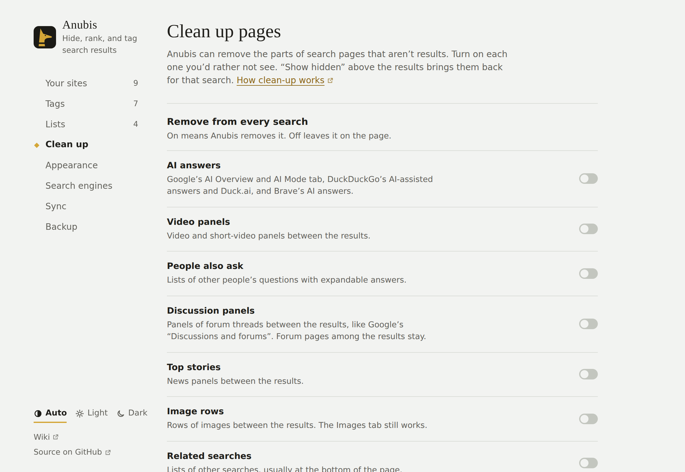
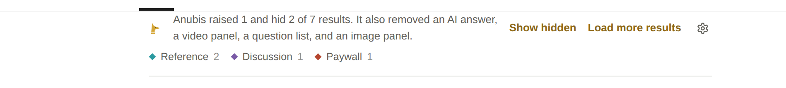

# Cleaning up pages

Search pages carry a lot that isn't results: AI answers, video panels, "People also ask". **Settings → Clean up** removes the ones you turn on, on every search: a switch that's on means Anubis removes that part, and off leaves it on the page.

| Switch | What it removes |
| --- | --- |
| **AI answers** | Google's AI Overview and its AI Mode tab, DuckDuckGo's AI-assisted answers and its Duck.ai tab and buttons, Brave's AI answers. |
| **Video panels** | Video and short-video panels between the results. |
| **People also ask** | Lists of other people's questions with expandable answers. |
| **Discussion panels** | Panels of forum threads between the results, like Google's "Discussions and forums" and Brave's "Discussions". Forum pages among the results stay. |
| **Top stories** | News panels between the results. |
| **Image rows** | Rows of images between the results. The Images tab still works. |
| **Related searches** | Lists of other searches, usually at the bottom of the page, and the "People also search for" box Bing and Google add under a result you went to and came back from. The links to later pages stay. |

All of them start off.

On Bing, the AI answer and the "Videos of…" panel aren't removed yet.

## What was removed

The summary above the results, or above an AI answer when there is one, says what went: "It also removed an AI answer and a video panel." **Show hidden** brings removed panels back on that page, with a dashed outline so you can tell them apart.

## How panels are found

Anubis recognises a panel by its heading ("AI Overview", "Videos", "People also ask") rather than by the engine's internal names for it, which change often. It only removes panels between the results. The side panel on the right of Google's results is left alone, and so is anything containing a result, the search box, or the links to later pages.

Headings are recognised in English and some common translations (French, German, Spanish, Portuguese, Italian, and Dutch). If a panel in your language isn't removed, [open an issue](https://github.com/Bishop-V/anubis/issues) with the heading's exact text.

## Stopping AI answers at the source

Removing a panel after the engine sends it depends on recognising it. Google has its own view without AI, and Anubis can use it:

- **Google:** **Always open the Web tab** opens Google's own "Web" view (the one under **More → Web**), which shows plain links with no AI Overview and no panels at all. This is a separate switch because it removes everything that isn't a link, including panels you might want. To see the usual page for one search, choose **All** above the results.
