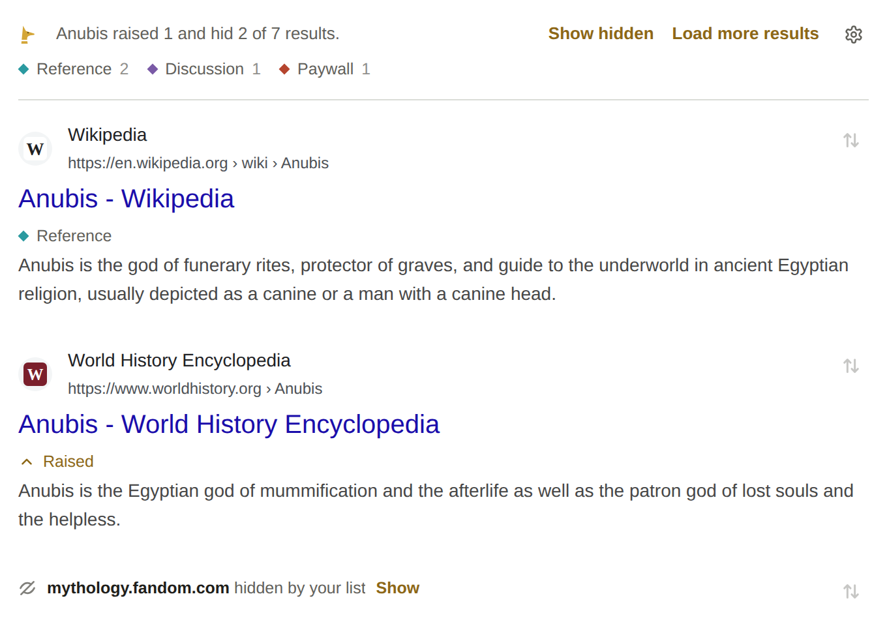
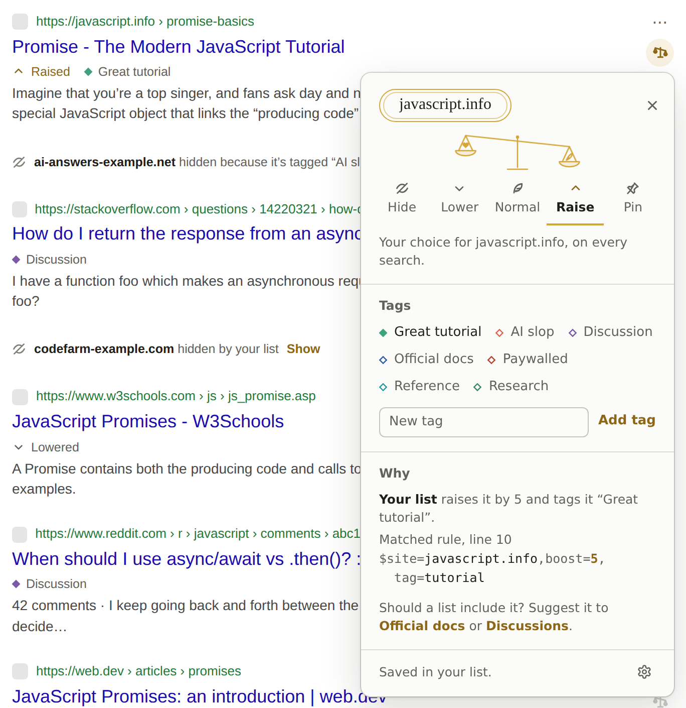
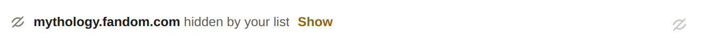
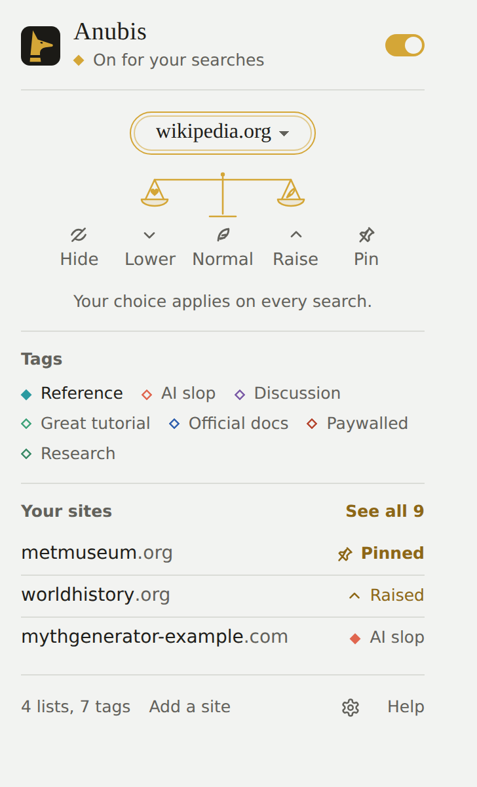

# Getting started

## Install

Anubis isn't in the Firefox or Chrome stores yet. To try it, build it from the source code. You need [Node.js](https://nodejs.org) 20 or newer.

```sh
git clone https://github.com/Bishop-V/anubis.git
cd anubis
npm install
npm run build          # for Firefox
npm run build:chrome   # for Chrome, Edge, and other Chromium browsers
```

Then load it:

- **Firefox:** open `about:debugging`, choose **This Firefox**, then **Load Temporary Add-on**, and pick `.output/firefox-mv2/manifest.json`. Firefox removes temporary add-ons when it closes.
- **Chrome:** open `chrome://extensions`, turn on **Developer mode**, choose **Load unpacked**, and pick the `.output/chrome-mv3` folder.

When Anubis is installed, it opens a welcome tab with the steps for your browser to keep its button in the toolbar, a search to try, and the lists you start with.

Browsers put new extensions behind the Extensions button (a puzzle piece) next to the address bar. To keep Anubis's button in view:

- **Chrome:** press the puzzle piece, then the pin beside Anubis.
- **Edge:** press the puzzle piece, then the eye beside Anubis.
- **Firefox:** press the puzzle piece, then the gear beside Anubis, and choose **Pin to Toolbar**.

## Search as usual

Search on any [supported engine](./search-engines.md). Anubis starts with a few lists that tag official documentation, discussions, reference sites, and paywalls, so you'll see tags under some results straight away.

A one-line summary above the results says what Anubis did: which results it raised, lowered, or hid, and which tags are on the page.



## Hide a site

Hover a result and press the ⇅ button at its top-right corner. In the menu, choose **Hide**.



The result disappears, and so will every result from that site, on every search. The summary above the results counts what was hidden and says "Hid fandom.com." with an **Undo** button, which puts the site back as it was.

- **Show hidden** in the summary shows every hidden result on the page, faded, until you press it again.
- To stop hiding the site, show it, open its menu, and choose **Normal**.
- To leave a line where each hidden result was, choose **Collapse** in **Settings → Appearance → Hidden results**:



Your choice applies to the whole site, including its subdomains. The name at the top of the menu picks how much of the site it covers: `en.wikipedia.org` or all of `wikipedia.org`.

## Rank the site you're on

Press the Anubis icon in the toolbar while you're on any website. The popup shows the site's name over the balance: choose how its results should rank in future searches, and tag it if you like. When the site's address has more than one part, like `en.wikipedia.org`, press the name to choose how much of it your choice covers.

On a search page the popup instead says what Anubis did to the results, with **Show hidden**, **Load more results**, and the page's tags, to show only the results with one of them. On any other page, **Add a site** takes a site's name and the ranking to give it.



## Turn Anubis off

The switch in the toolbar popup turns Anubis off without uninstalling it. Its icon turns grey, and search pages are left as they are.

## Keyboard shortcuts

- **Alt+Shift+O** turns Anubis on or off.
- **Alt+Shift+H** shows the hidden results on the page, and hides them again.

On a Mac, press Control instead of Alt. To change them, open `chrome://extensions/shortcuts` in Chrome, or in Firefox open `about:addons`, press the gear button, and choose **Manage Extension Shortcuts**. If another extension already uses one of these keys, your browser leaves that shortcut empty until you choose a key for it.

## Help

**Help** in the toolbar popup opens this wiki. In **Settings**, each section links to its page here, and **Wiki** at the bottom of the sidebar opens the start.

## Next

- [Ranking sites](./ranking.md): what Lower, Raise, and Pin do.
- [Tags](./tags.md): tag sites and decide what tags do.
- [Subscribing to lists](./lists.md): let other people's lists do the work.
- [Cleaning up pages](./clean-up.md): remove AI answers and other panels.
