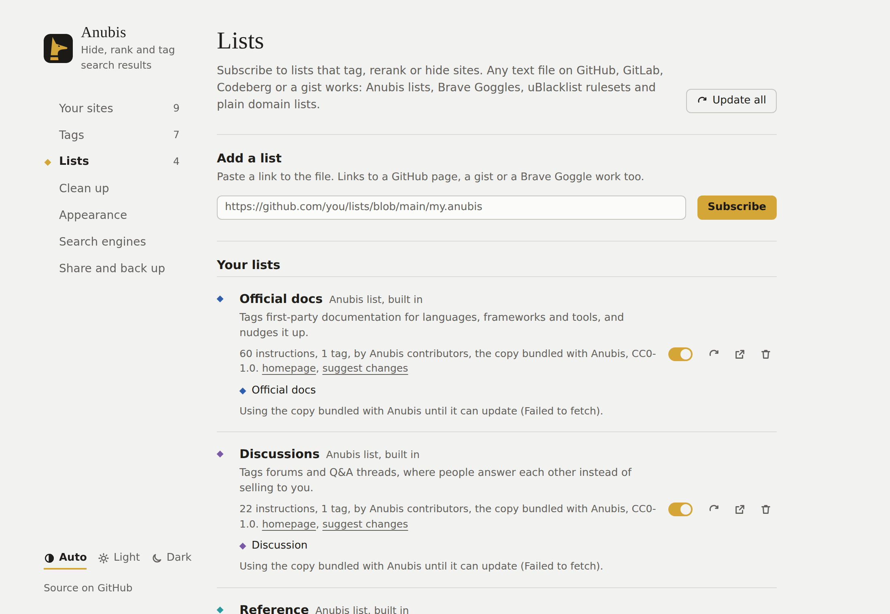

# Subscribing to lists

A list tags, raises, lowers or hides sites for you. Anyone can publish one: it's a text file in a Git repository, a gist or any public web address. There's no Anubis server in between.

Anubis starts subscribed to four small lists that ship with it: **Official docs**, **Discussions**, **Reference** and **Paywalls**. They mostly add tags.

## Subscribe

- **From the directory:** **Settings → Lists → More lists** shows lists other people have published. Press **Subscribe** on one. The same directory is on the [Lists directory](../lists.md) page.
- **From a link:** paste the list's address into **Add a list** and press **Subscribe**. Links to a file's page on GitHub, GitLab or Codeberg, gist links and Brave Search Goggle links all work; Anubis finds the raw file.

Lists hosted on GitHub or in a gist download straight away. For a list hosted anywhere else, your browser asks you to allow Anubis to read from that one site.

## What lists work

- Anubis lists (`.anubis` files)
- [Brave Goggles](https://github.com/brave/goggles-quickstart)
- [uBlacklist](https://github.com/iorate/ublacklist) rulesets
- Plain lists of domains, one per line, and hosts files

Anubis detects the format itself. Rules it can't use, such as uBlacklist's title expressions, are skipped and counted under the list in settings.

::: warning Lenses
Some Brave Goggles are *lenses*: they hide every result they don't mention, so a search shows only the sites on the list. Anubis marks these with "lens" so you don't subscribe to one by surprise.
:::

## Updates

Anubis checks for new versions of your lists when the browser starts and while you search, at most every 30 minutes. Each list says how often it wants to be checked (usually once a day). **Update all** in **Settings → Lists** checks right away.

## Turn off, or unsubscribe

Each list in **Your lists** has a switch to turn it off for a while and a button to unsubscribe. Your own rankings always beat any list, so to overrule one list about one site, rank that site yourself.

## Suggest a site to a list

When a list has an issue tracker, the ⇅ menu on a result offers "Suggest it to *list name*". It opens a pre-filled issue on GitHub, GitLab or Codeberg for you to check and send. Nothing is sent until you submit it yourself.
