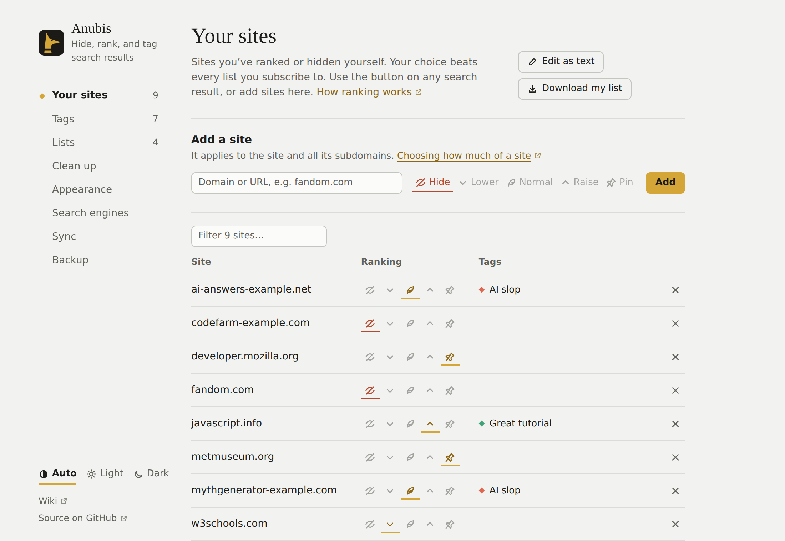

# Ranking sites

Every site has a *ranking*, which you choose from the ⇅ button on any of its results, from the toolbar popup, or in **Settings → Your sites**.

| Ranking | What happens to the site's results |
| --- | --- |
| **Hide** | They disappear, or shrink to one line you can open (see [Hidden results](#hidden-results)). |
| **Lower** | They move five places down and fade a little. |
| **Normal** | They stay where the engine put them, whatever your lists say. |
| **Raise** | They move five places up. |
| **Pin** | They go to the top, with a thin gold outline. |

Your choice always beats your lists. If a list lowers a site and you raise it, it's raised.

## How much of the site

A ranking covers a site and all of its subdomains. The name at the top of the menu chooses the level: choosing `wikipedia.org` covers every language's Wikipedia, and `en.wikipedia.org` only the English one. The most specific choice wins, so you can hide `fandom.com` and still raise `minecraft.fandom.com`.

## Reranking

Anubis reorders the results already on the page; it can't fetch results the engine didn't send. A raised result from the bottom of page 1 moves up, but a site that's only on page 3 needs [Load more results](./more-results.md) first.

To keep the engine's order and only use tags and hiding, turn off **Settings → Appearance → Rerank results**.

## Hidden results

**Settings → Appearance → Hidden results** sets how hidden results look:

- **Remove** (the default): gone from the page. The summary above the results counts them, and **Show hidden** brings them back.
- **Collapse**: one line naming the site and why it's hidden, with a **Show** button. Hidden results in a row share one line ("fandom.com and 5 more hidden by your list"), and its **Show** brings back all of them.
- **Dim**: left in place, faded.

## Your sites

**Settings → Your sites** lists every site you've ranked, with its tags. Change a ranking there, add a site by name, or edit the whole list as text.

Your sites are saved as a list in the [Anubis list format](../list-format.md), so you can [publish it](./publish-a-list.md) for others to subscribe to. It's kept in your browser's sync storage, so it follows you to other computers where you're signed in to the same browser account.
