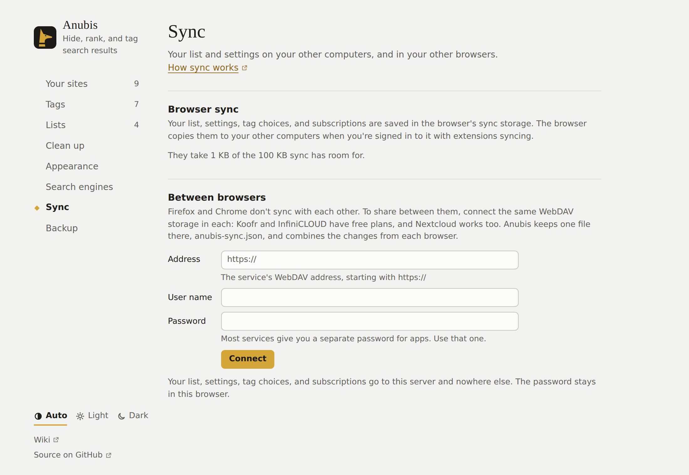

# Syncing between computers

Anubis has no account or server of its own. It saves your things in your browser's sync storage, and your browser copies them to your other computers. To share between Firefox and Chrome as well, you can connect a storage service of your own.

## What syncs

- **Your list**: every site you've ranked or tagged
- **Settings**
- **Tag choices**: what each tag does, and its name and colour
- **Subscriptions**: which lists you're subscribed to

The lists you subscribe to aren't copied between computers. Each computer downloads its own copy, from the same address.

## Browser sync

This is on from the start, with nothing to set up in Anubis. Anubis can't see whether your browser's sync is on, though. If a change doesn't show up on your other computer, check these settings on both.

- **Firefox:** sign in to Firefox with your Mozilla account. In Firefox's settings, under **Sync**, make sure **Add-ons** is ticked: that also syncs add-ons' data. Firefox syncs about every 10 minutes. To sync straight away, choose **Sync Now** in the same place.
- **Chrome:** sign in to Chrome with sync on, and keep **Extensions** among the things it syncs (Chrome's settings, under **You and Google**).

Browser sync only reaches the same browser on your other computers. Firefox and Chrome don't sync with each other, and Firefox for Android doesn't sync add-on data at all.

## Between browsers

To share between Firefox and Chrome, or with Firefox for Android, connect the same storage in each browser. It's optional, and nothing changes until you connect. Anubis works with any storage service that offers **WebDAV**, a standard way for apps to save files there. It keeps one file there, `anubis-sync.json`.

### Get an address and a password

You need three things from the service: its WebDAV address, your user name, and a password for apps. Most services don't accept your usual password here. They let you make a separate one for each app instead, which you can take back without changing your own.

| Service | Address | Password |
| --- | --- | --- |
| **Koofr** (10 GB free) | `https://app.koofr.net/dav/Koofr` | In Koofr, **Preferences → Password → App passwords**: make one. Your user name is your email address. |
| **InfiniCLOUD** (20 GB free) | Shown on your account page, under **Apps Connection**, once you turn it on | The same page shows the user name and password for apps. |
| **Nextcloud** | `https://your-server/remote.php/dav/files/your-user-name/` | **Settings → Security → Devices & sessions**: create an app password. |

Other services and your own server work too, if they offer WebDAV over `https://`. Any folder will do: give its address, and Anubis puts its file there. An address ending in `.json` is used as the file itself.

### Connect

<!-- Maintainer: this generated screenshot comes from the mock Settings page. If the shown interface changes, run `node e2e/run.mjs docs`, then update the affected light/dark image and its description together. -->

1. Open **Settings → Sync**, and under **Between browsers** enter the address, your user name, and the password.
2. Press **Connect**. The browser asks you to let Anubis reach that server. Firefox also asks whether Anubis may send your list there.
3. Do the same in your other browser.

**Settings → Sync** then shows when Anubis last synced, or what went wrong. **Sync now** syncs straight away.

### When it syncs

- A few seconds after you change something
- When the browser starts
- When you search, at most every 5 minutes

### Changes from both browsers

Anubis combines the changes from each browser, so nothing is lost when you use both:

- A site you hide in Firefox and a site you tag in Chrome both stay.
- If you raise a site in one browser and tag it in the other, it ends up raised and tagged.
- If both browsers change the same thing before they've synced, such as the same site's ranking or the same setting, the browser that syncs last wins.

The first time a browser connects, it takes everything from the file. Sites and settings you changed in that browser before connecting are kept too, unless the file changed the same ones.

### Disconnect

**Disconnect** in **Settings → Sync** stops syncing in that browser. Your list and settings stay in the browser, and the file stays on the server. Delete the file there if you want it gone.

## Limits

- **Size:** browser sync holds about 100 KB for each add-on. Anubis compresses your list before saving it, so about 10,000 sites fit. **Settings → Sync** shows how much room they take. If your list outgrows it, browser sync keeps it on that computer only and Settings says so; settings, tag choices, and subscriptions still sync. Syncing through a server has no such limit.
- **Lists from other hosts:** if you subscribe to a list that isn't on GitHub, each browser asks for permission to download it. After syncing, press that list's **Update now** button (↻) in **Settings → Lists** in the other browser to allow it there.
- **Moving just once:** you can also [export a backup](./import-and-backup.md#back-up) and restore it in the other browser. The sync file is in the same format, so **Restore backup** reads it too.

## Privacy

Browser sync goes through your browser account, like your bookmarks. Anubis never sees it.

When you connect a server, your list, settings, tag choices, and subscriptions go to that server and nowhere else. The user name and password are kept in that browser only, never in browser sync. See [Privacy and permissions](./privacy.md).
