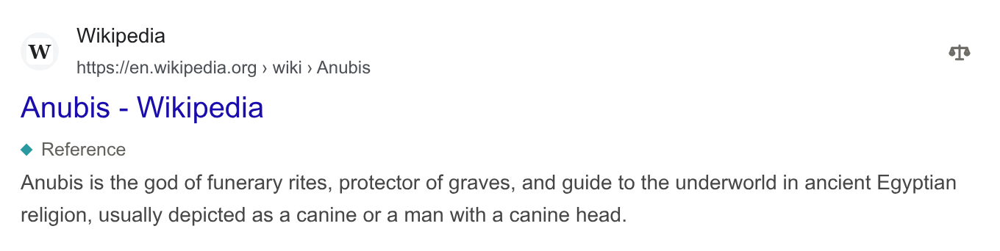
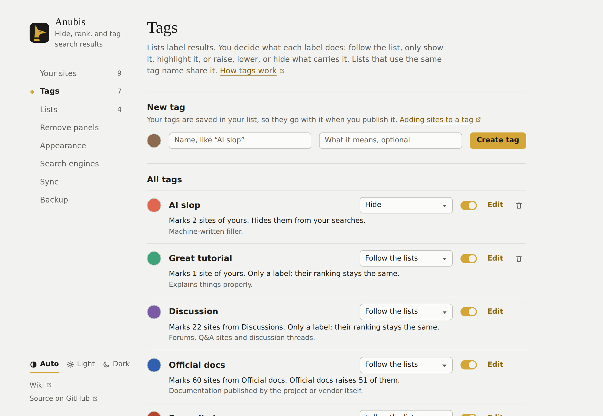

# Tags

Tags are small labels under a result's title: "Official docs", "Discussion", "Paywalled". They come from the lists you subscribe to and from your own choices.

<!-- Maintainer: the generated screenshots on this page come from mock pages. If the shown interface changes, run `node e2e/run.mjs docs`, then update the affected light/dark images and their descriptions together. -->

## Tag a site yourself

Open the ⚖ menu on a result. Under **Tags**, press a tag to add it to the site, or press it again to remove it. To make a new tag, type its name in **New tag** and press **Add tag**.

Tags from lists appear in the menu too, but only the list can remove them.

## Decide what a tag does

A list decides which sites get a tag. You decide what the tag does, in **Settings → Tags**:

| Choice | What happens to results with the tag |
| --- | --- |
| **Follow the lists** | Whatever the list says (the default). Most lists only label. |
| **Label only** | Show the label, never change the ranking. |
| **Highlight** | Give the result a faint background in the tag's colour. |
| **Raise** / **Lower** | Move the result five places up or down. |
| **Hide** | Hide the result, whichever list tagged it. |

Under each tag's name, one line says which sites carry it and what happens to them, for example "Marks 23 sites from Paywalls. Only a label: their ranking stays the same." The Paywalls list only labels; to lower paywalled sites, choose **Lower** for the tag.

Turn off **Shown** to keep a tag working without showing its label under results. Press a tag's colour to change it. To see every tag in grey on search pages, choose **Plain** in **Settings → Appearance → Colours on search pages**. Tags are then told apart by their names.

## Tag sites yourself

Press **Edit** beside a tag to open it. There you can:

- rename it, and give your own tags a description;
- see your sites with the tag, and press × to untag one;
- tag more sites: type one, or several separated by spaces or commas, and press **Add site**. This works for any tag, including tags from lists;
- see the first sites each of your lists gives the tag.

The ⚖ button on a search result tags that result's site the same way.

### Several tags on one result

When a result carries several tags you've set to **Raise** or **Lower**, Anubis weighs them together: each Raise moves it five places up and each Lower five places down.

| Tags on the result | Where it goes |
| --- | --- |
| One Raise | Five places up |
| Three Raise | Fifteen places up |
| Two Raise and one Lower | Five places up, as if it had one Raise |
| One Raise and one Lower | Where the search engine put it |

A tag counts once, however many of your lists give it. A tag set to **Hide** still hides the result, whatever the others say. **Why** in the result's ⚖ menu shows each tag's part and where the result ends up ("raise it by 5 each for “Official docs” and “Reference” and lower it by 5 for “Paywall”, so it moves 5 places up").

A ranking you gave a site yourself beats any tag. If you raised a site, a tag set to Hide won't hide it.

## Show only one tag

The summary above the results lists the tags on the page and how many results have each. Press one to show only those results; press **Show all** to go back. On a phone, press **Details** in the summary to see them.

## Shared tags

Tags are identified by a short id like `ai-slop`. When two lists use the same id, you see one tag fed by both. That's how lists by different people can build a shared vocabulary; see [the list format](../list-format.md#tags).
